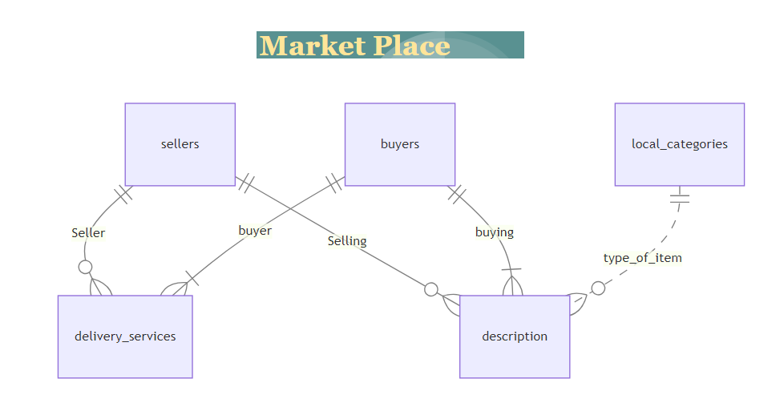

# Deitign Document

By Anum Rehman.

Video overview: (https://youtu.be/b8fYSjFaQ64)

## Scope

In this section you should answer the following questions:

* What is the purpose of your database? It is the database about a market place. where we can search for buyer and seller detail, what they are selling and buying and what services they are using and if they are selling or giving away.
* Which people, places, things, etc. are you including in the scope of your database? People who are buying an selling on market place and their postal codes.
* Which people, places, things, etc. are *outside* the scope of your database? out of scope are other attributes of peope like nationalities, city, education.

## Functional Requirements

In this section you should answer the following questions:

* What should a user be able to do with your database? a user can get information about the seller and buyer along with what he is buying and what services they are using.

## Representation
Entities are captured in SQLite tables with the following schema.

### Entities

The database includes the following entities:

#### buyers

The `buyers` table includes:

* `id`, which specifies the unique ID for the buyer as an `INTEGER`. This column thus has the `PRIMARY KEY` constraint applied.
* `name`, which specifies the buyer's first name as `TEXT`, given `TEXT` is appropriate for name fields.
* `email`, which specifies the buyer's email. `TEXT` is used for the same reason as `name.Which is UNIQUE for every buyer
* `postal_code`, which specifies the buyer's residence postal code. `INTEGER` is used.
* `contact_num`, which specifies when the contact number of buyer. Which is UNIQUE for every buyer.

#### sellers

The `sellers` table includes:

* `id`, which specifies the unique ID for the seller as an `INTEGER`. This column thus has the `PRIMARY KEY` constraint applied.
* `name`, which specifies the seller's first name as `TEXT`, given `TEXT` is appropriate for name fields.
* `email`, which specifies the seller's email. `TEXT` is used for the same reason as `name. Which is UNIQUE for every seller.
* `postal_code`, which specifies the seller's residence postal code. `INTEGER` is used.
* `contact_num`, which specifies when the contact number of seller. Which is UNIQUE for every buyer.

#### delivery_service

The `delivery_service` table includes:

* `id`, which specifies the unique ID for the seller as an `INTEGER`. This column thus has the `PRIMARY KEY` constraint applied.
* `buyer_id`, which is the ID of the buyer who made the submission as an `INTEGER`. This column thus has the `FOREIGN KEY` constraint applied, referencing the `id` column in the `buyers` table to ensure data integrity.
* `seller_id`, which is the ID of the problem which the submission solves as an `INTEGER`. This column thus has the `FOREIGN KEY` constraint applied, referencing the `id` column in the `sellers` table to ensure data integrity.
* `service_name`, which specifies the delivery service's name as `TEXT`, given `TEXT` is appropriate for name fields.
* `delivery_days`, which specifies the days delivery service can take. `INTEGER` is used for the number of days.
* `delivery_charges`, which specifies the delivery service charges. `INTEGER` is used for price.

#### local_categories

The `local_categories` table includes:

* `id`, which specifies the unique ID for the instructor as an `INTEGER`. This column thus has the `PRIMARY KEY` constraint applied.
* `category`, which specifies the categories of the products being selling and buying on market place as `TEXT`, given `TEXT` is appropriate for name fields.
* `used_or_new`, which specifies the product is either new or used as `TEXT`.
* `sell_or_givenaway`, which specifies the product is either being sold or given away as `TEXT`.

#### description

The `description` table includes:

* `id`, which specifies the unique ID for the instructor as an `INTEGER`. This column thus has the `PRIMARY KEY` constraint applied.
* `buyer_id`, which is the ID of the buyer who made the submission as an `INTEGER`. This column thus has the `FOREIGN KEY` constraint applied, referencing the `id` column in the `buyers` table to ensure data integrity.
* `seller_id`, which is the ID of the problem which the submission solves as an `INTEGER`. This column thus has the `FOREIGN KEY` constraint applied, referencing the `id` column in the `sellers` table to ensure data integrity.
* `category_id`, which is the ID of the problem which the submission solves as an `INTEGER`. This column thus has the `FOREIGN KEY` constraint applied, referencing the `id` column in the `local_categories` table to ensure data integrity.
* `item_name`, which specifies the name of the products being selling and buying on market place as `TEXT`, given `TEXT` is appropriate for name fields.
* `price`, which specifies the price of product is as `INTEGER`.
* `sending`, which specifies the product is either being sent or no as `TEXT`.

### Relationships

The below entity relationship diagram describes the relationships among the entities in the database.

## Optimizations

I have created a index as "search_seller_name" on "description" to search for the seller name based on desciption.
I have created a index as "search_item_name" ON "description" to seach for item name.
I have created a index as"search_delivery_service" ON "delivery_service" search delivery services attributes by buyer name.
I have created a index as "search_buyer" ON "buyers" to search specific name.
I have created a index as "search_delivery_service_charges ON "delivery_service" to search for specific charges.

## Limitations

* What are the limitations of your design?
I only have inserted few rows in database so it does not have cases where categories, delivery services are repeating for buyers or sellers. it only contains different attributes for different users of market place.
* What might your database not be able to represent very well?
Due to having very little datain database it is not able to represent variety of cases.
